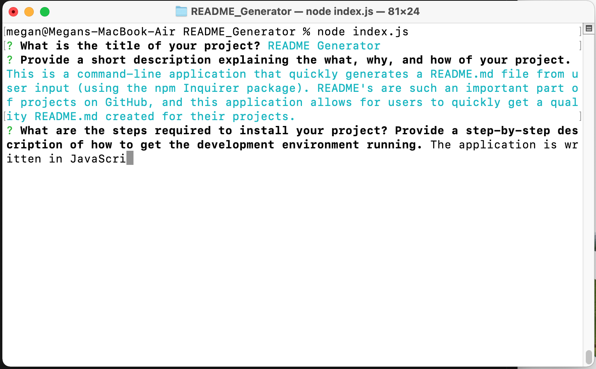
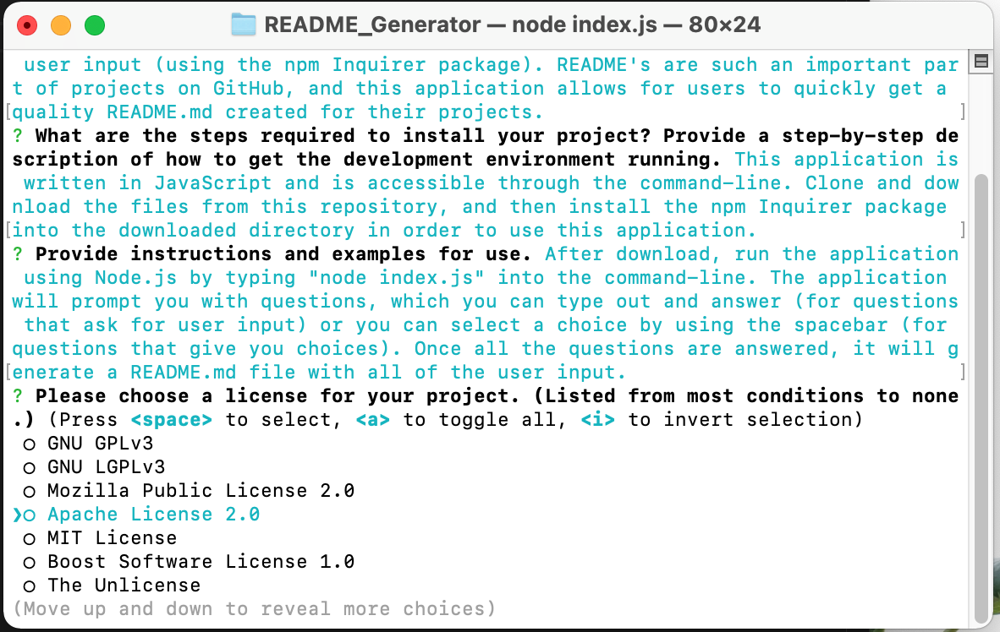

# README Generator

## Description

This is a command-line application that quickly generates a README.md file from user input (using the npm Inquirer package). README's are such an important part of projects on GitHub, and this application allows for users to quickly get a quality README.md created for their projects. 
    
## Table of Contents
 - [Installation](#installation)
 - [Usage](#usage)
 - [License](#license)
 - [Contributing](#contributing)
 - [Tests](#tests)
 - [Questions](#questions)
    
    
## Installation

This application is written in JavaScript and is accessible through the command-line. Clone and download the files from this repository, and then install the npm Inquirer package into the downloaded directory in order to use this application. 
    
## Usage

After download, run the application using Node.js by typing "node index.js" into the command-line. The application will prompt you with questions, which you can type out and answer (for questions that ask for user input) or you can select a choice by using the spacebar (for questions that give you choices). Once all the questions are answered, it will generate a README.md file with all of the user input.

*(Click on GIF to be taken to the video of the walkthrough.)*

*As the application prompts the user with questions, type in the answers and hit Enter.*

*For selecting a choice, use the arrow keys to navigate to the correct selection and use spacebar to select, before hitting Enter.*

## License

This project is licensed under [MIT License](https://opensource.org/licenses/MIT).
    
## Contributing

As of right now, contribution to this application is not something I am actively looking for. 
    
## Tests

There are no tests written for this application currently.
    
## Questions

See more of my work on my [GitHub Profile](https://github.com/msteblu/).
For any additional questions, reach me at my email: megan@steblay.net.